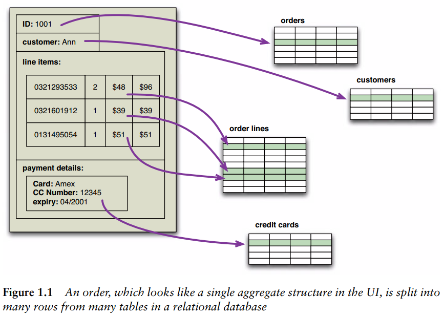

The difference between the relational model and the in-memory data structures is called impedance mismatch. The relational data model organizes data into a structure of tables and rows, or more properly, relations and tuples.

In particular, the values in a relational tuple have to be simple—they cannot contain any structure, such as a nested record or a list. This limitation isn’t true for in-memory data structures, which can take on much richer structures than relations. As a result, if you want to use a richer in-memory data structure, you have to translate it to a relational representation to store it on disk.

