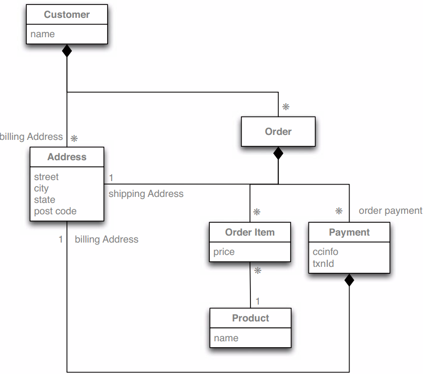

Various data modeling techniques have provided ways of marking aggregate or composite structures. The problem, however, is that modelers rarely provide any semantics for what makes an aggregate relationship different from any other;

Relational databases have no concept of aggregate within their data model, so we call them aggregate-ignorant. In the NoSQL world, graph databases are also aggregate-ignorant.

Consider the bellow data model for a store management; If a retailer wants to analyze its product sales over the last few months, then an order aggregate becomes a trouble. To get to product sales history, you’ll have to dig into every aggregate in the database.

The clinching reason for aggregate orientation is that it helps greatly with running on a cluster; If we’re running on a cluster, we need to minimize how many nodes we need to query when we are gathering data. By explicitly including aggregates, we give the database important information about which bits of data will be manipulated together, and thus should live on the same node.

Relational databases allow you to manipulate any combination of rows from any tables in a single transaction. Such transactions are called **ACID** transactions: **Atomic**, **Consistent**, **Isolated**, and **Durable**.

In general, it’s true that aggregate-oriented databases don’t have ACID transactions that span multiple aggregates. Instead, they support atomic manipulation of a single aggregate at a time. This means that if we need to manipulate multiple aggregates in an atomic way, we have to manage that ourselves in the application code.
