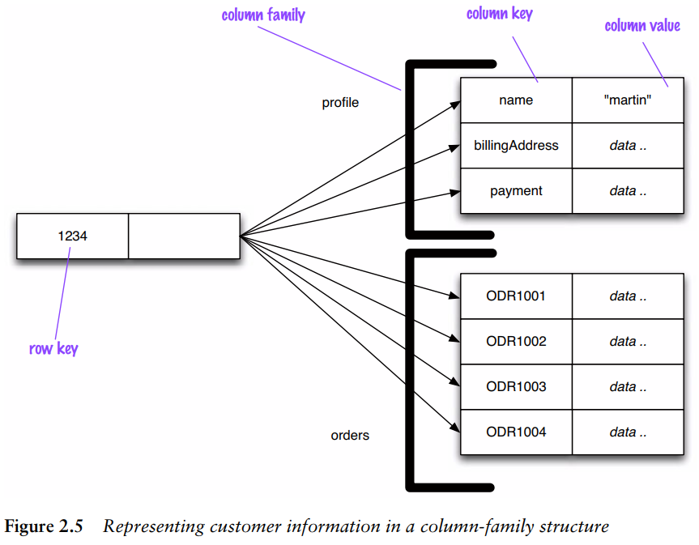

Most databases have a row as a unit of storage which, in particular, helps write performance. However, there are many scenarios where writes are rare, but you often need to read a few columns of many rows at once. In this situation, it’s better to store groups of columns for all rows as the basic storage unit—which is why these databases are called column stores.

Perhaps the best way to think of the column-family model is as a two-level aggregate structure. As with key-value stores, the first key is often described as a row identifier, picking up the aggregate of interest. The difference with column family structures is that this row aggregate is itself formed of a map of more detailed values. These second-level values are referred to as columns. As well as accessing the row as a whole, operations also allow picking out a particular column, so to get a particular customer’s name from Figure 2.5 you could do something like get('1234', 'name').

Column-family databases organize their columns into column families. Each column has to be part of a single column family, and the column acts as unit for access, with the assumption that data for a particular column family will be usually accessed together.

This also gives you a couple of ways to think about how the data is structured:
- Row-oriented: Each row is an aggregate (for example, customer with the ID of 1234) with column families representing useful chunks of data (profile, order history) within that aggregate.
- Column-oriented: Each column family defines a record type (e.g., customer profiles) with rows for each of the records. You then think of a row as the join of records in all column families.

