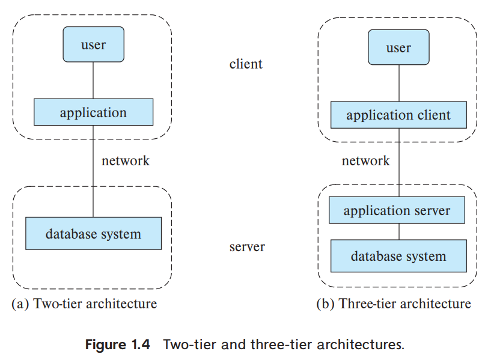

Earlier-generation database applications used a two-tier architecture, where the application resides at the client machine, and invokes database system functionality at the server machine through query language statements.

In contrast, modern database applications use a three-tier architecture, where the client machine acts as merely a front end and does not contain any direct database calls; web browsers and mobile applications are the most commonly used application clients today. The front end communicates with an application server. The application server, in turn, communicates with a database system to access data. The business logic of the application, which says what actions to carry out under what conditions, is embedded in the application server, instead of being distributed across multiple clients. Three-tier applications provide better security as well as better performance than two-tier applications.

