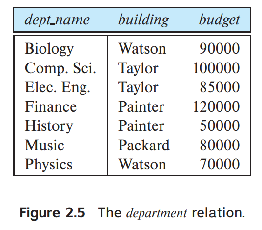

We must differentiate between the database schema, which is the logical design of the database, and the database instance, which is a snapshot of the data in the database at a given instant in time.
Consider the department relation of Figure 2.5. The schema for that relation is:

							`department (dept name, building, budget)`
							
The concept of a relation corresponds to the programming-language notion of a variable, while the concept of a relation schema corresponds to the programming language notion of type definition.

