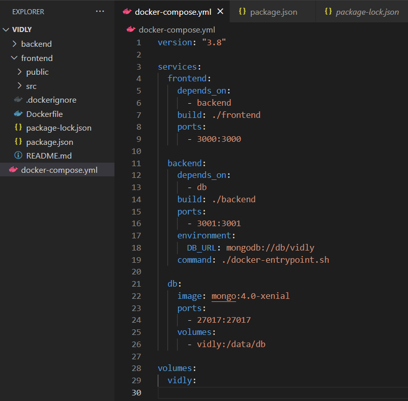

When we are dealing with multiple container applications, we have docker files specific for each of them with their specific instructions. To build images out of the docker files and run the containers, we can create a `.yml` fill called `docker-compose.yml` which contains necessary instructions to run containers. There is an example below:

- `version`: determines the compose file version compatible with the docker engine we're using which could be checked [here](https://docs.docker.com/compose/compose-file/compose-versioning/)
- `services`: