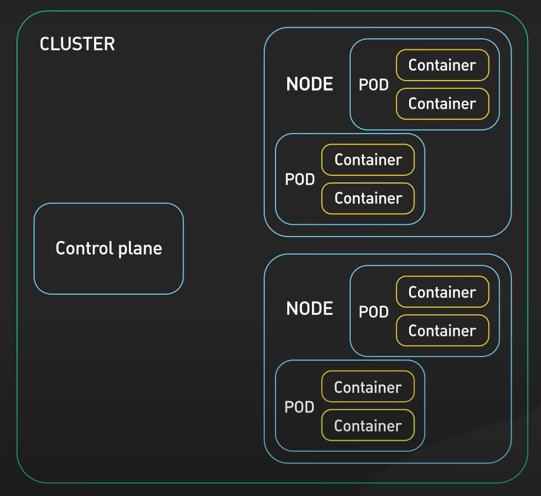
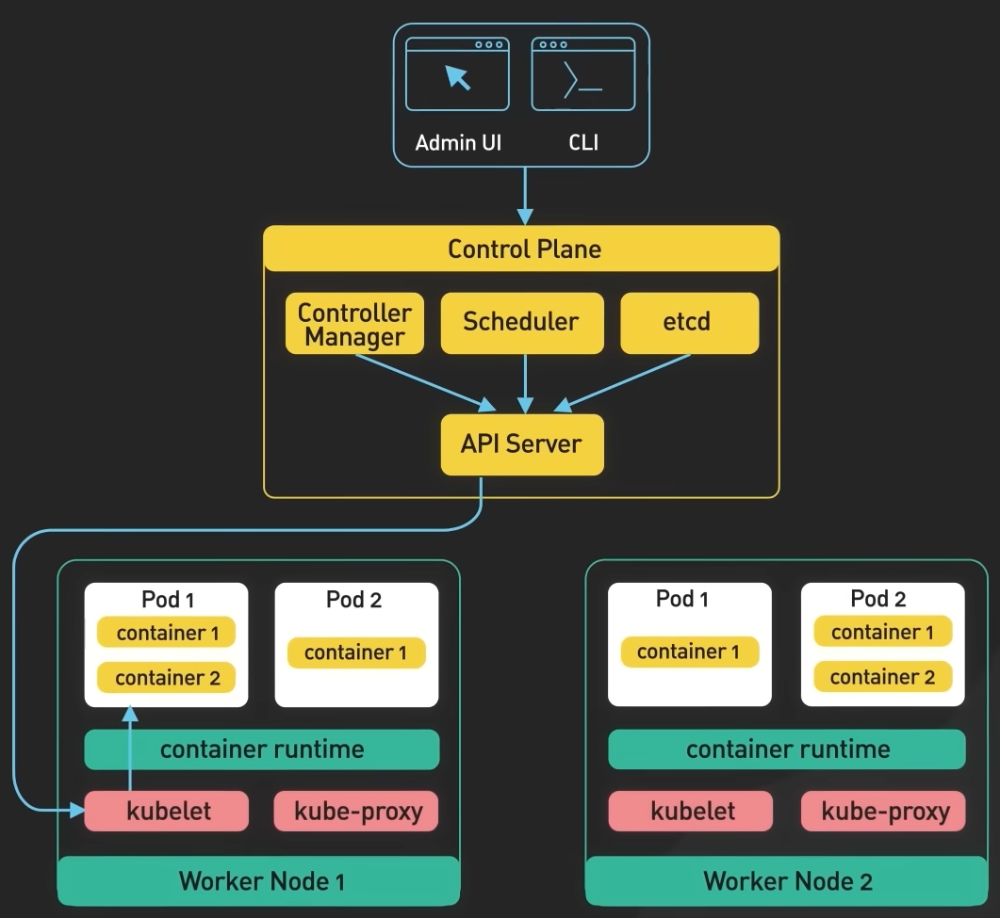
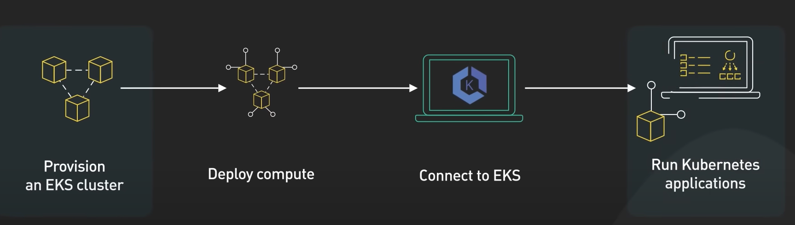

 Kubernetes is an open source container orchestration tool which automates deployment, scaling, management of containerized applications.
 A Kubernetes cluster consists of a set of machines called nodes, that are used to run containerized apps.

Two main parts of a cluster are Control Plane and Worker Nodes.
**Control Plane**: It is responsible for manage the state of the cluster. It usually runs on multiple nodes that span across several data centers.
	1. API server: Is a primary interface between the Control Plane and rest of the cluster. It expose a Restful API that allows the clients to interact with the CP and submit request to manage the cluster.
	2. ETCD: It is a key-value store which stores the cluster's persistent states (e.g. what states are changed, is cluster healthy, what resources are available etc.) It is also used by the rest of CP components to store and retrieve info about cluster
	3. Scheduler: It is responsible for scheduling pods on the worker nodes. It used information about resources required by the pods and available resources on the worker nodes to make placement decisions of the pods.
	4. Controller Manager: It is responsible for running controllers that manage the state of the cluster (e.g. Replication Controller which ensures the desired number of replicas of a pod are running, Deployment Controller which manages the rolling update and rollback of deployments).

**Worker Nodes**: The run containerized application workloads. The containerized applications run in a pod which is the smallest deployable unit in Kubernetes. 
	1. Pod: A pod hosts one or more containers and provide shared storage and networking for those containers. Pods are created and managed by the CP.
	2. Kubelet: It is a daemon that runs on each worker node and is responsible for communicating with the CP. It receives instructions from CP about which pods to run on the node and ensures that the desired state of the pods is maintained.
	3. Container Runtime: Runs the containers on the worker nodes. Responsible for pulling a container from a registry, start-stopping the containers and managing the containers' resources.
	4. Kube Proxy: It is a network proxy that runs on each node. Responsible for routing traffic to the correct pods, load balancing in the node and ensuring the traffic is evenly distributed among the them.
	

**  Pros and Cons of Kubernetes**
  - It makes it possible to scale applications up and down as we want to
  - It is portable and helps us deploy and manage apps in a consistent way, regardless of the underlying infrastructure.
  - It is complex and requires expertise.
  - Costly
  
One option to strike a balance is to offload the management of the CP to a Managed Kubernetes Service like Amazon EKS, Google Kubernetes Engine (GKS) and Azure Kubernetes Service (AKS). These services allow organizations to run the Kubernetes apps without worrying about underlying infrastructure. They take care of complex tasks like setting up and configuring CP, scaling the cluster, providing maintenance 

### References
[ByteByteGo-YouTube](https://www.youtube.com/watch?v=TlHvYWVUZyc&t=1s)
