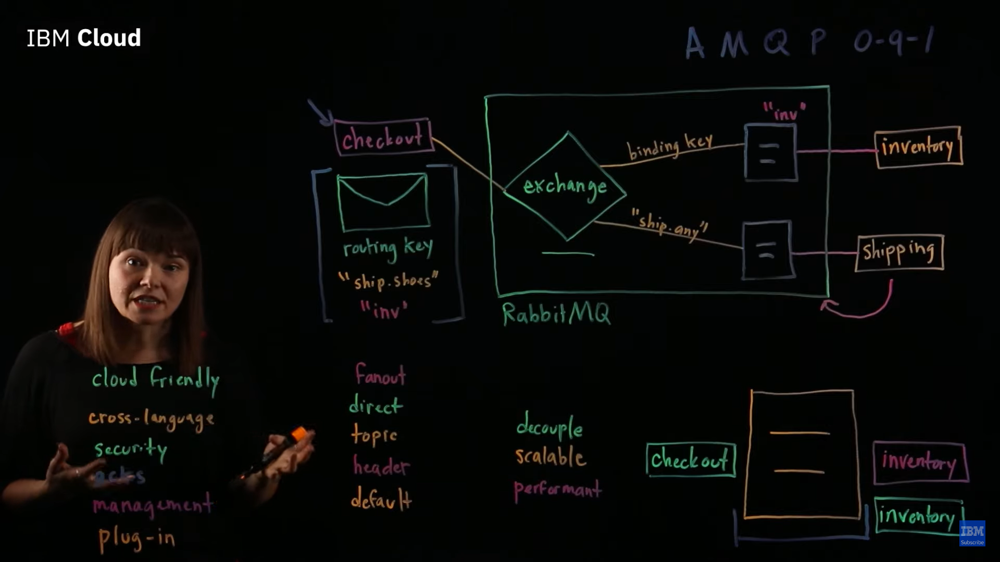

RabbitMQ is a message broker based on AMQP 0-9-1 protocol. This broker receives messages from publishers (i.e. producers - applications producing messages) and routes them to consumers. Since [AMQP]([[AMQP]]) is a network protocol, publishers, consumers and the broker can reside on different machines.

#### Exchange
An exchange is responsible for routing the messages to different queues with the help of header attributes, bindings, and routing keys. A binding is a link that you set up to bind a queue to an exchange.