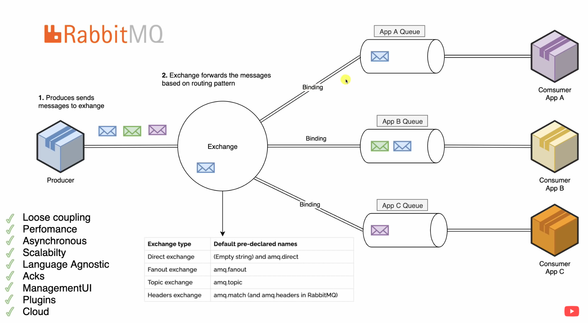

RabbitMQ is a message broker based on AMQP 0-9-1 protocol. This broker receives messages from publishers (i.e. producers - applications producing messages) and routes them to consumers. Since [AMQP](AMQP.md) is a network protocol, publishers, consumers and the broker can reside on different machines.

#### Exchange
An exchange is a message routing agent and is responsible for routing the messages to different queues with the help of header attributes, bindings, and routing keys. A binding is a link that you set up to bind a queue to an exchange.
When producers send messages, firstly the exchange will get them. We can have multiple exchanges and each of them can be bind to multiple queues.
There are different types of exchanges in RabbitMQ:
1. Direct: The routing key should be exactly as same as the direct binding key.
2. Fanout: It just broadcasts all the messages it receives to all the queues it knows. And that's exactly what we need for our logger.
3. Topic: It is for partial matches between routing key and binding keys.
4. Headers: Consider the message header instead of routing key 
5. Default(i.e. nameless exchange): When routing key is equal to the queue name

### Refernces
[RabbitMQ.com](https://www.rabbitmq.com/tutorials/tutorial-one-go.html)
[Amigoscode-YouTube](https://www.youtube.com/watch?v=nFxjaVmFj5E&t=1500s)
