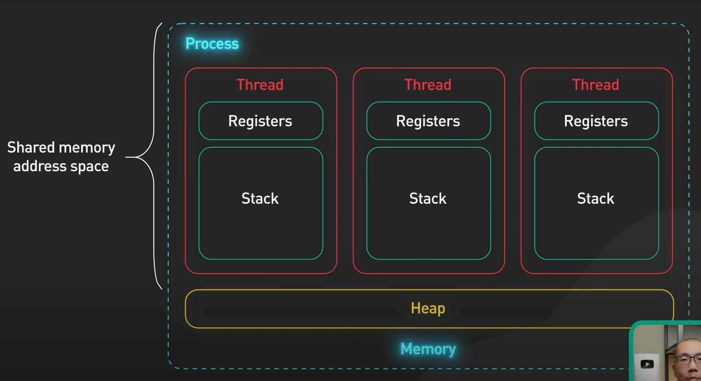

**Program**
A program generally is some lines of codes or processor instructions which is executable and can be run. The code is saved on the disk; It could be loaded to the memory (RAM) and run by the processor. 

**Process**  
The running program is called a process; Each _process_ provides the resources (CPU, I/O, RAM) needed to execute a program which are managed by the OS. A process has a virtual address space, executable code, open handles to system objects, a security context, a unique process identifier (PID), environment variables, a priority class, minimum and maximum working set sizes, and at least one thread of execution. Each process is started with a single thread, often called the _primary (main) thread_, but can create additional threads from any of its threads.
Each process has its own memory address space which is seperated from others, so if a process malfunctions, does not effect other ones. (e.g. Google Chrome runs each tab with its process so if one tab is buggy or being attacked, another ones won't be touched)

**Thread**  
A _thread_ is an executing unit within a process that can be scheduled for execution. All threads of a process share its virtual address space and system resources and can communicate with each other and if a thread is broken it can bring down the whole process. In addition, each thread maintains exception handlers, a scheduling priority, thread local storage, a unique thread identifier, and a set of structures the system will use to save the thread context until it is scheduled. The _thread context_ includes the thread's set of machine registers, the kernel stack, a thread environment block, and a user stack in the address space of the thread's process. Threads can also have their own security context, which can be used for impersonating clients.

