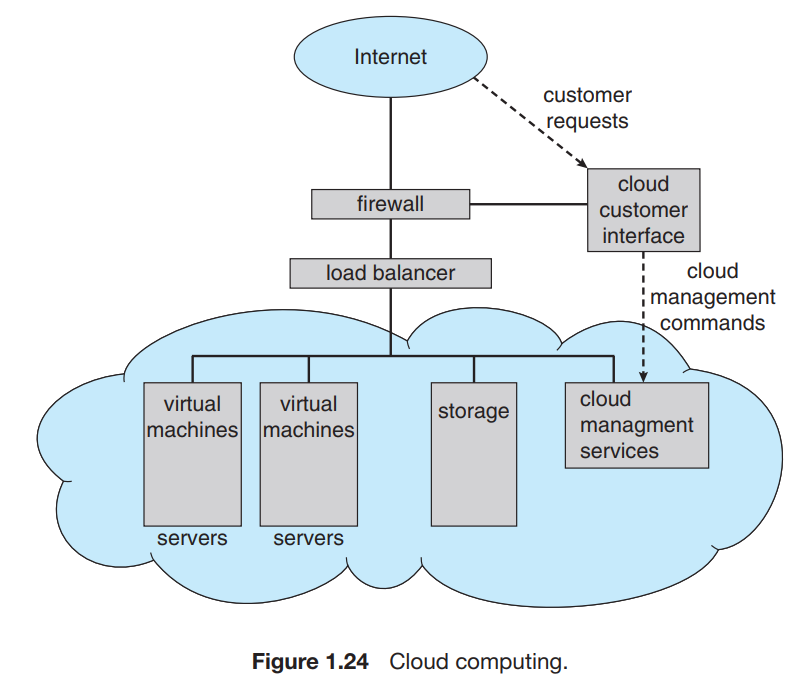

Cloud computing is a type of computing that *delivers computing, storage, and even applications as a service across a network*. In some ways, it’s a logical extension of virtualization, because it uses virtualization as a base for its functionality. There are actually many types of cloud computing, including the following:

- Public cloud: a cloud available via the Internet to anyone willing to pay for the services
- Private cloud: a cloud run by a company for that company’s own use
- Hybrid cloud: a cloud that includes both public and private cloud components
- Software as a service (SaaS): one or more applications (such as word processors or spreadsheets) available via the Internet
- Platform as a service (PaaS): a software stack ready for application use via the Internet (for example, a database server)
- Infrastructure as a service (IaaS): servers or storage available over the Internet (for example, storage available for making backup copies of production data)

These cloud-computing types are not discrete, as a cloud computing environment may provide a combination of several types. For example, an organization may provide both SaaS and IaaS as publicly available services.

Certainly, there are traditional operating systems within many of the types of cloud infrastructure. Beyond those are the VMMs that manage the virtual machines in which the user processes run. At a higher level, the VMMs themselves are managed by cloud management tools, such as VMware vCloud Director and the open-source Eucalyptus toolset. These tools manage the resources within a given cloud and provide interfaces to the cloud components, making a good argument for considering them a new type of operating system.

Figure 1.24 illustrates a public cloud providing IaaS. Notice that both the cloud services and the cloud user interface are protected by a firewall.

