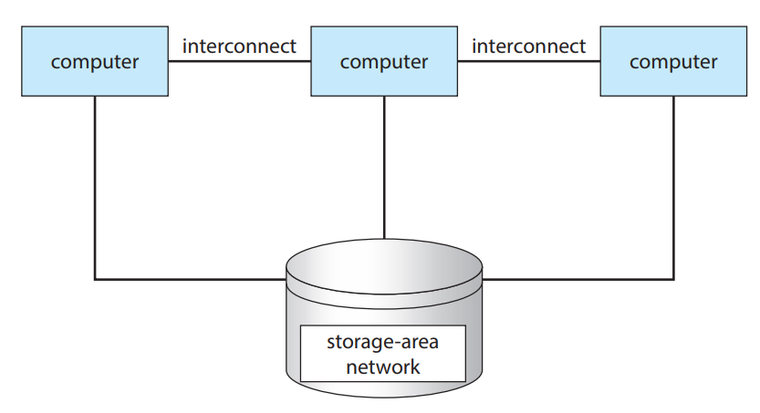

The generally accepted definition is that clustered computers share storage and are closely linked via a local-area network LAN or a faster interconnect, such as InfiniBand.
Clustering is usually used to provide high-availability service—that is, service that will continue even if one or more systems in the cluster fail.

Clustering can be structured asymmetrically or symmetrically. In asymmetric clustering, one machine is in hot-standby mode while the other is running the applications. The hot-standby host machine does nothing but monitor the active server. If that server fails, the hot-standby host becomes the active server. In symmetric clustering, two or more hosts are running applications and are monitoring each other.

