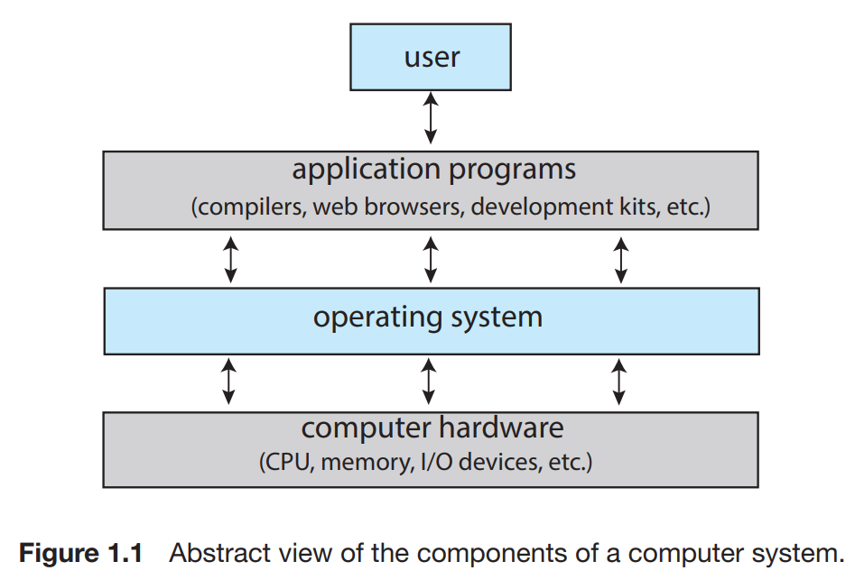

Another aspect of a modern system is its collection of system services. At the lowest level is hardware. Next is the operating system, then the system services, and finally the application programs. System services, also known as **system utilities**, provide a convenient environment for program development and execution. Some of them are simply user interfaces to system calls.  They can be divided into these categories:

- File management. These programs create, delete, copy, rename, print, list, and generally access and manipulate files and directories.

- Status information. Some programs simply ask the system for the date, time, amount of available memory or disk space, number of users, or similar status information.

- File modification . Several text editors may be available to create and modify the content of files stored on disk or other storage devices. 

- Programming-language support. Compilers, assemblers, debuggers, and interpreters for common programming languages (such as C, C++, Java, and Python) are often provided with the operating system or available as a separate download.

- Program loading and execution. Once a program is assembled or compiled, it must be loaded into memory to be executed. The system may provide absolute loaders, relocatable loaders, linkage editors, and overlay loaders.

- Communications. These programs provide the mechanism for creating virtual connections among processes, users, and computer systems. 

- Background services. All general-purpose systems have methods for launching certain system-program processes at boot time. Some of these processes terminate after completing their tasks, while others continue to run until the system is halted.

