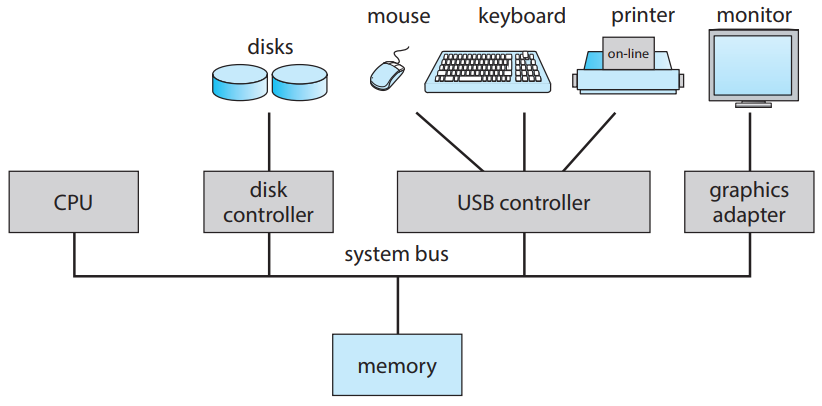

A general-purpose computer system consists of multiple devices, all of which exchange data via a common bus. The form of interrupt-driven I/O is fine for moving small amounts of data but can produce high overhead when used for bulk data movement such as NVS I/O. To solve this problem, direct memory access (DMA) is used. After setting up buffers, pointers, and counters for the I/O device, the *device controller* transfers an entire block of data directly to or from the device and main memory, with no intervention by the CPU. Only one interrupt is generated per block, to tell the *device driver* that the operation has completed, rather than the one interrupt per byte generated for low-speed devices. While the device controller is performing these operations, the CPU is available to accomplish other work.

