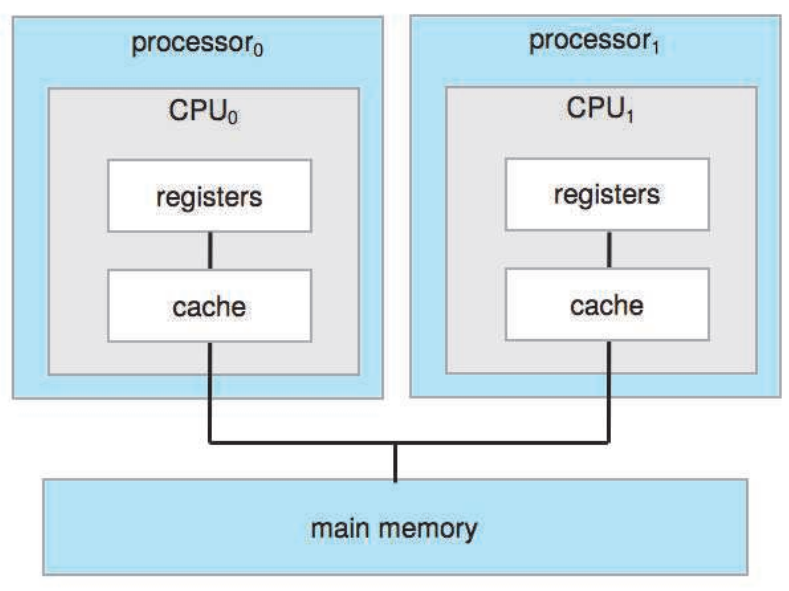
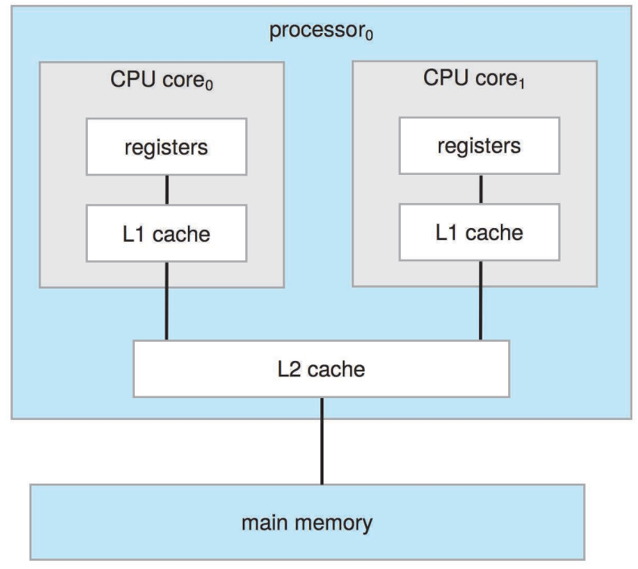
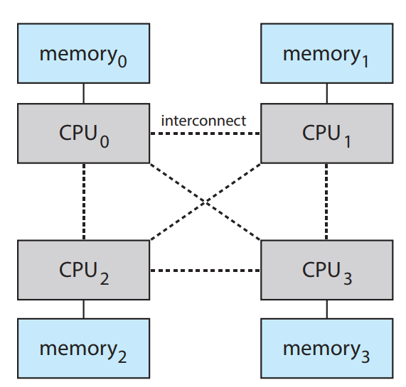

#### Definitions of Computer System Components

- **Core**: The basic computation unit of CPU
- **CPU**: The hardware that executes instructions
- **Processor**: A physical chip than contains one or more CPUs
- **Multicore**: Including multiple computing cores on the same CPU
- **Multiprocessor**: Including multiple processors

The most common multiprocessor systems use symmetric multiprocessing (SMP), in which each peer CPU processor performs all tasks, including operating-system functions and user processes. Figure below illustrates a typical SMP architecture with two processors, each with its own CPU. Notice that each CPU processor has its own set of registers, as well as a private—or local— cache. However, all processors share physical memory over the system bus.

The definition of multiprocessor has evolved over time and now includes multicore systems, in which multiple computing cores reside on a single chip. Multicore systems can be more efficient than multiple chips with single cores because on-chip *communication is faster* than between-chip communication. In addition, one chip with multiple cores uses significantly *less power* than multiple single-core chips.
In figure bellow, we show a dual-core design with two cores on the same processor chip. In this design, each core has its own register set, as well as its own local cache, often known as a level 1, or L1, cache. Notice, too, that a level 2 (L2) cache is local to the chip but is shared by the two processing cores. Most architectures adopt this approach, combining local and shared caches, where local, lower-level caches are generally smaller and faster than higher-level shared cache.

Adding additional CPUs to a multiprocessor system will increase computing power; however, the concept does not scale very well, and once we add too many CPUs, contention for the system bus becomes a bottleneck and performance begins to degrade. An alternative approach is instead to provide each CPU (or group of CPUs) with *its own local memory* that is accessed via a small, fast local bus. The CPUs are connected by a shared system interconnect, so that *all CPUs share one physical address space*. This approach—known as non-uniform memory access, or NUMA—is illustrated in figure bellow. The advantage is that, when a CPU accesses its local memory, not only is it fast, but there is also no contention over the system interconnect.

Finally, blade servers are systems in which multiple processor boards, I/O boards, and networking boards are placed in the same chassis. The difference between these and traditional multiprocessor systems is that each blade processor board boots independently and runs its own operating system. Some blade-server boards are multiprocessor as well, which blurs the lines between types of computers. In essence, these servers consist of multiple independent multiprocessor systems.
