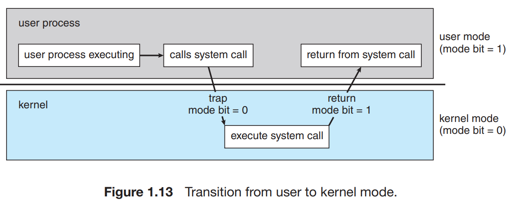

In order to ensure the proper execution of the system, we need two separate modes of operation: **user mode** and **kernel mode** (also called **supervisor mode**, **system mode**, or **privileged mode**). A bit, called the *mode bit*, is added to the hardware of the computer to indicate the current mode: kernel (0) or user (1). When the computer system is executing on behalf of a user application, the system is in user mode. However, when a user application requests a service from the operating system (via a system call), the system must do the transition from user to kernel mode to fulfill the request. This is shown in figure bellow.

At system boot time, the hardware starts in kernel mode. The operating system is then loaded and starts user applications in user mode. Whenever a trap or interrupt occurs, the hardware switches from user mode to kernel mode (that is, changes the state of the mode bit to 0). Thus, *whenever the OS gains control of the computer, it is in kernel mode*. The system always switches to user mode (by setting the mode bit to 1) before passing control to a user program. If an attempt is made to execute a privileged instruction in user mode, the hardware does not execute the instruction but rather treats it as illegal and traps it to the operating system.

The instruction to switch to kernel mode is an example of a privileged instruction. Some other examples include I/O control, timer management, and interrupt management. 

The concept of modes can be extended beyond two modes. CPUs that support virtualization frequently have a separate mode to indicate when the virtual machine manager (VMM) is in control of the system. In this mode, the VMM has more privileges than user processes but fewer than the kernel. It needs that level of privilege so it can create and manage virtual machines, changing the CPU state to do so.

System calls provide the means for a user program to ask the operating system to perform tasks reserved for the operating system on the user program’s behalf. A system call is invoked in a variety of ways, depending on the functionality provided by the underlying processor. A system call usually takes the form of a trap to a specific location in the interrupt vector. This trap can be executed by a generic trap instruction, although some systems have a specific `syscall` instruction to invoke a system call.

When a system call is executed, it is typically treated by the hardware as a software interrupt. Control passes through the interrupt vector to a service routine in the operating system, and the mode bit is set to kernel mode. *The system-call service routine is a part of the operating system*.