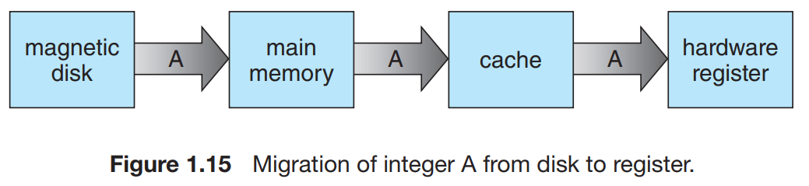

When we need a particular piece of information, we first check whether it is in the cache. If it is, we use the information directly from the cache. If it is not, we use the information from the source, putting a copy in the cache under the assumption that we will need it again soon.

In a hierarchical storage structure, the same data may appear in different levels of the storage system. For example, suppose that an integer A that is to be incremented by 1 is located in file B, and file B resides on hard disk. The increment operation proceeds by first issuing an I/O operation to **copy the disk block on which A resides to main memory**. This operation is followed by **copying A to the cache and to an internal register**. Thus, the copy of A appears in several places: on the hard disk, in main memory, in the cache, and in an internal register. Once the increment takes place in the internal register, the value of A differs in the various storage systems. The value of A becomes the same only after the new value of A is written from the internal register back to the hard disk.

1.In a computing environment where only one process executes at a time, this arrangement poses no difficulties, however, 2. In a multitasking environment, where the CPU is switched back and forth among various processes, 3. In a multiprocessor environment where, in addition to maintaining internal registers, each of the CPUs also contains a local cache and a copy of A may exist simultaneously in several caches and 4. In a distributed environment, which several copies (or replicas) of the same file can be kept on different computers the situation becomes more and more complex.