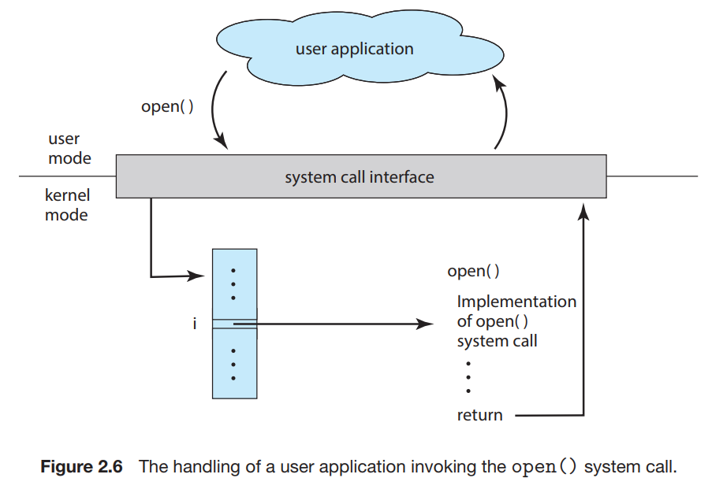
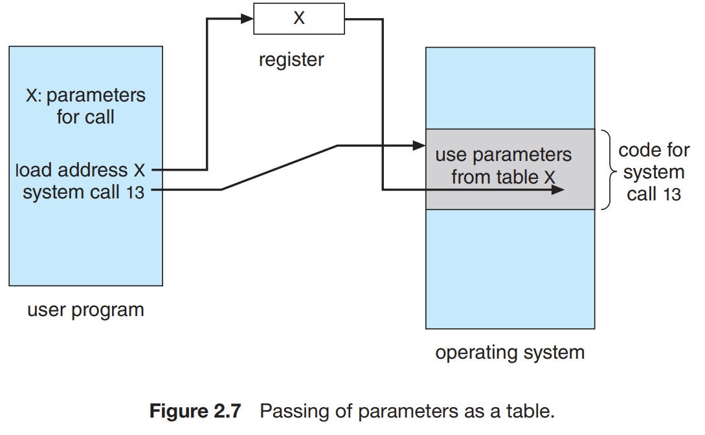

Typically, application developers design programs according to an application programming interface (API). The API specifies a set of functions that are available to an application programmer, including the parameters that are passed to each function and the return values the programmer can expect.

A programmer accesses an API via a library of code provided by the operating system. Each operating system has its own name for each system call.

Behind the scenes, the functions that make up an API typically invoke the actual system calls on behalf of the application programmer. For example, the Windows function `CreateProcess()` (which is used to create a new process) actually invokes the `NTCreateProcess()` system call in the Windows kernel.

An application programmer prefers programming according to an API rather than invoking actual system calls:
- One benefit concerns program portability. An application programmer designing a program using an API can expect her program to compile and run on any system that supports the same API.
- Actual system calls can often be more detailed and difficult to work with than the API available to an application programmer.

Another important factor in handling system calls is the run-time environment (RTE)—the full suite of software needed to execute applications written in a given programming language, including its compilers or interpreters as well as other software, such as libraries and loaders. The RTE provides a *system-call interface* that serves as the link to system calls made available by the operating system. The system-call interface intercepts function calls in the API and invokes the necessary system calls within the operating system.

Often, more information is required than simply the identity of the desired system call. Three general methods are used to pass parameters to the operating system:
- The simplest approach is to pass the parameters in registers.
- In some cases, there may be more parameters than registers. In these cases, the parameters are generally stored in a block, or table, in memory, and the address of the block is passed as a parameter in a register (figure below)
- Parameters also can be placed, or pushed, onto a stack by the program and popped off the stack by the operating system.

