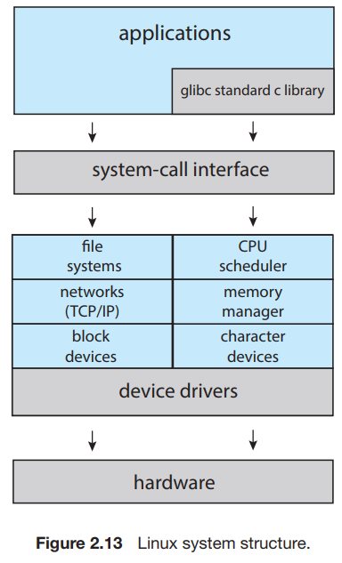

The simplest structure for organizing an operating system is no structure at all. That is, place all of the functionality of the kernel into a single, static binary file that runs in a single address space.

An example of such limited structuring is the original UNIX operating system, which consists of two separable parts: the kernel and the system programs. The kernel is further separated into a series of interfaces and device drivers, which have been added and expanded over the years as UNIX has evolved.

We can view the traditional UNIX operating system in Figure 2.12. The kernel provides the file system, CPU scheduling, memory management, and other operating system functions through system calls.

The Linux operating system is based on UNIX and is structured similarly, as shown in Figure 2.13. Applications typically use the `glibc` standard C library when communicating with the system call interface to the kernel. The Linux kernel is monolithic in that it runs entirely in kernel mode in a single address space, but it does have a modular design that allows the kernel to be modified during run time.

