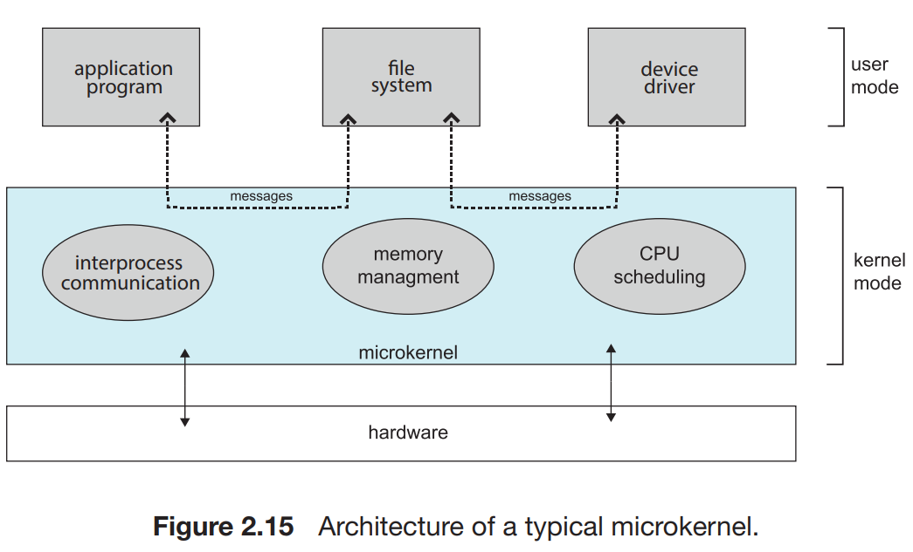

This method structures the operating system by removing all nonessential components from the kernel and implementing them as user level programs that reside in separate address spaces. The result is a smaller kernel. 

The main function of the microkernel is to provide communication between the client program and the various services that are also running in user space. Communication is provided through message passing. For example, if the client program wishes to access a file, it must interact with the file server. The client program and service never interact directly. Rather, they communicate indirectly by exchanging messages with the microkernel.

One benefit of the microkernel approach is that it makes extending the operating system easier. All new services are added to user space and consequently do not require modification of the kernel.

The microkernel also provides more security and reliability, since most services are running as user—rather than kernel—processes. If a service fails, the rest of the operating system remains untouched.

Unfortunately, the performance of microkernels can suffer due to increased system-function overhead. When two user-level services must communicate, messages must be copied between the services, which reside in separate address spaces. In addition, the operating system may have to switch from one process to the next to exchange the messages.

Perhaps the best-known illustration of a microkernel operating system is Darwin, the kernel component of the macOS and iOS operating systems. Darwin, in fact, consists of two kernels, one of which is the Mach microkernel

