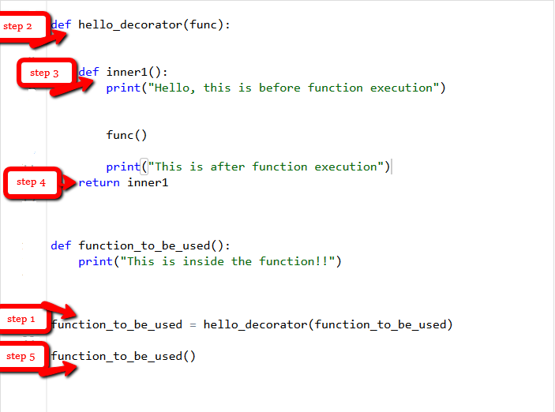
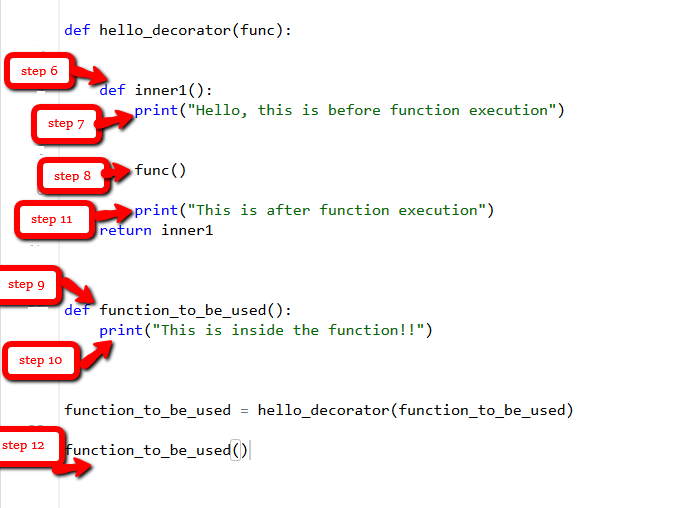

Decorators allow us to wrap another function in order to extend the behavior of the wrapped function, without permanently modifying it. 
##### First Class Objects  
In Python, functions are [first class objects](https://www.geeksforgeeks.org/first-class-functions-python/) which means that functions in Python can be used or passed as arguments.

**Example:** Returning functions from another function.
```python
# Functions can return another function
def create_adder(x):

	def adder(y):
		return x+y

	return adder

add_15 = create_adder(15)

print(add_15(10))
```
**Output:**
```
25
```

**Decorator can modify the behavior:**
```python
# defining a decorator
def hello_decorator(func):

	# inner1 is a Wrapper function in which the argument is called
	
	# inner function can access the outer local
	# functions like in this case "func"
	def inner1():
		print("Hello, this is before function execution")

		# calling the actual function now inside the wrapper function.
		func()

		print("This is after function execution")
		
	return inner1


# defining a function, to be called inside wrapper
def function_to_be_used():
	print("This is inside the function !!")

# passing 'function_to_be_used' inside the decorator to control its behaviour
function_to_be_used = hello_decorator(function_to_be_used)

# calling the function
function_to_be_used()
```
**Output:**
```
Hello, this is before function execution
This is inside the function !!
This is after function execution
```

Execution of the codes above, step by step:




**The last four lines of the code above code also be written like:**
```python
@hello_decorator
def function_to_be_used():
	print("This is inside the function !!")

function_to_be_used()
```


#### Reference 
[GeeksForGeeks](https://www.geeksforgeeks.org/decorators-in-python/)
