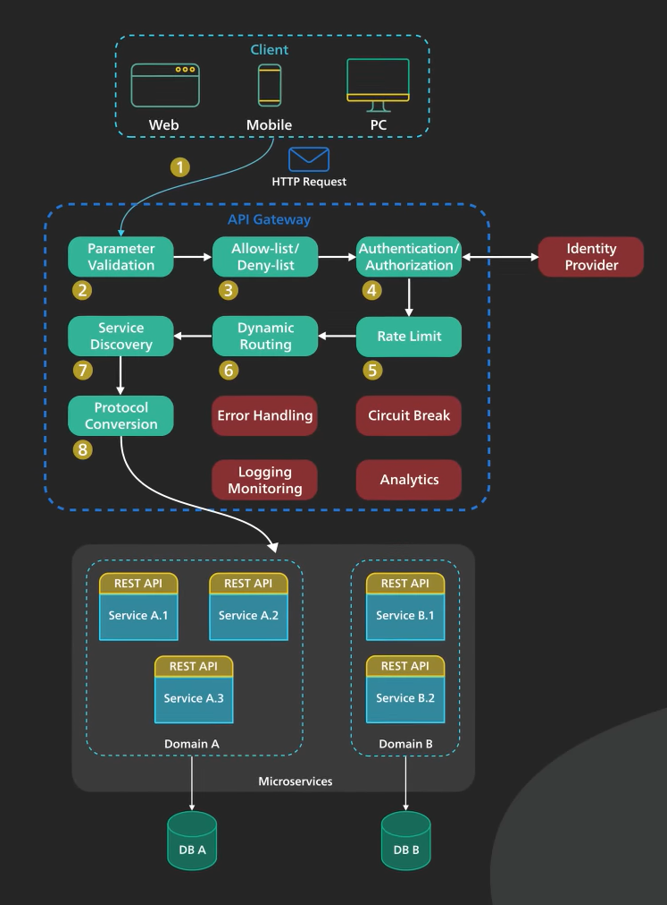

In the first days, applications were built monolithically which means all the logic was in one place and the app was a single unit. Extending applications and increasing their complexity made them difficult to maintain so a solution was to build applications in multitier architecture (like MVP) which contained three layers, each having their tasks. After a while the same problem showed up again so the new approach was to use a new architecture called microservice. 
In this architecture, each service is being developed, built, tested separately with their own database and even maybe different languages and deployed on different infrastructures. 
Microservice architecture contains some important components:

#### Monitoring Tools

#### Container Tools

#### Container Orchestration Tools
Docker Swarm - Kubernetes

#### CI/CD Pipelines

#### Brokers
Communications between microservices is conducted using tools like [message brokers]([[What are message brokers]]). 

#### Load Balancing

#### Forward Proxy vs Reverse Proxy
A forward proxy is a server sitting between a group of client machines and the internet, acts as a middleman and talks to the web servers in behalf of those machines. Reasons to use it:
1. It protects clients' online identity and IP of the client is hidden from web server
2. Can bypass browsing restrictions. By connecting to the forward proxy outside the firewall, so the client can go around the restriction (But sometimes the firewall could block the connection to the proxy)
3. Can block access to certain contents  

A reverse proxy (like NGINX) sits between the internet and web servers and talks to them in behalf of the clients. Why?
1. Protect the website by hiding its IP and avoid DDoS attacks
2. It can be used for load balancing by distributing the incoming requests between a pool of web servers so none them is overloaded
3. It can cache a piece of static content for a period of time so response to the requests itself without calling the webservers
4. SSL handshake is computationally expensive so the reverse proxy can free origin servers from it by handling SSL encryption itself. Instead of handling SSL handshake for all clients, it can only do it for a number of reverse proxies

Reverse proxies can have multiple layers. Layer like Edge Servers deployed around the world, API Gateway or Load Balancer at the hosting provider. Many cloud providers combine these two into a single Ingress Service; The user would enter the cloud network at the edge server closest to him and from the edge, the reverse proxy connects over a fast fiber network to its load balancer where the request is evenly distributed over a cluster of web servers.

#### API Gateway
API gateway is a single point of entry to the client of an application. (e.g. Amazon API Gateway, Azure) It sits between the client and a collection of backend services for the app. In other words, an API gateway is an API management server that has information about endpoints. It can provide multiple functionalities:
- Authentication and security policy enforcement
- Caching
- Monitoring, logging, analytics and billing
- Protocol translation and service discovery
- Load balancing and circuit breaking

Lets consider a flow of a client request through the API gateway to the backend services:
1. Client sends a request to the API gateway (which is usually HTTP based but it could be GraphQL or REST API)
2. API gateway validates the request parameters
3. API gateway checks callers IP and other HTTP headers with its allow/deny list (Or even some rate checking) 
4. API gateway check for the request authentication and authorization, using an identity provider.
5. Rate limit check is applied against the authenticated session and if it is over the limits, request will be rejected
6. Dynamic Routing; At this level and the next one, API gateway locates the appropriate backend service to handle the request using path matching
7. Service Discovery
8. API gateway transforms the request to appropriate protocol and send the transformed request to the determined backend service.( An example protocol could be gRPC) 
9. When the response comes from the backend service, API gateway transforms it to the suitable protocol and returns it to the client.

API gateway should track errors and proving circuit breaking functionalities to protect services from overloading.
It is a critical piece of infrastructure and has tp be deployed in different regions to improve availability. 

### References 

**Forward vs Reverse Proxy**
[ByteByteGo-YouTube](https://www.youtube.com/watch?v=4NB0NDtOwIQ)

**API Gateway**
[ByteByteGo-YouTube](https://www.youtube.com/watch?v=6ULyxuHKxg8)
[GEEKFLARE](https://geekflare.com/api-gateway/)
