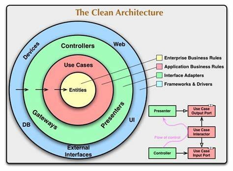

The objective of the Clean Architecture is to separate the *main codebase* of the application from parts of the code that deal with external libraries and systems. It is done in an organized way so that each code type lives on its place. For instance, there is a place for code related to *databases* and another one for *web requests*.

Being a Layered Architecture, Clean Architecture is divided into layers as shown in the picture below. The inner layers are unaware of the outer layers. The code that resides in a layer can access other code in the same layer.

#### The Entities layer
The Entities layer is the innermost layer of the Clean Architecture and represents the domain models. The Entities layer can’t access the database as well.

#### The Use Cases layer
Business rules are implemented in the Use Cases layer. For instance, in software that manages queues, the part of the code that deals with queues will be in the use cases layer. However, in a shopping cart microservice that uses queues, the part of the code that deals with queues probably won’t be in the Use Cases layer. 

#### The Interface Adapters layer
The Interface Adapters layer serves as an interface to external systems, facilitating a future switch of an external system. For example, a change in the storage system (filesystem, different types of databases, etc).
Usually, code related to a storage system won’t access either the Use Cases and Entities layers. However, Controllers’ code like CLI or web related will access those inner layers. For instance, when a user chooses an option on a CLI or submits a form in a web interface, code from the outer layers will call Use Cases layer code.
To access the outer layers, the Use Cases layer must use an interface and dependency inversion.

#### The External Systems layer
However, a system built inside the company that doesn’t do business rules related to this specific project may also be in the External Systems layer. For instance, if Amazon.com's store website uses Amazon SQS, it would be in the External Systems layer, although Amazon has developed SQS as well.
Note that the Amazon SQS codebase could also be implemented using Clean Architecture and its Use Cases layer would contain the business rules for this specific project.
Code that lives in the External Systems layer can interact with all the other layers.

#### References
[LinkedIn](https://www.linkedin.com/pulse/implementation-clean-architecture-python-part-1-cli-watanabe/)
