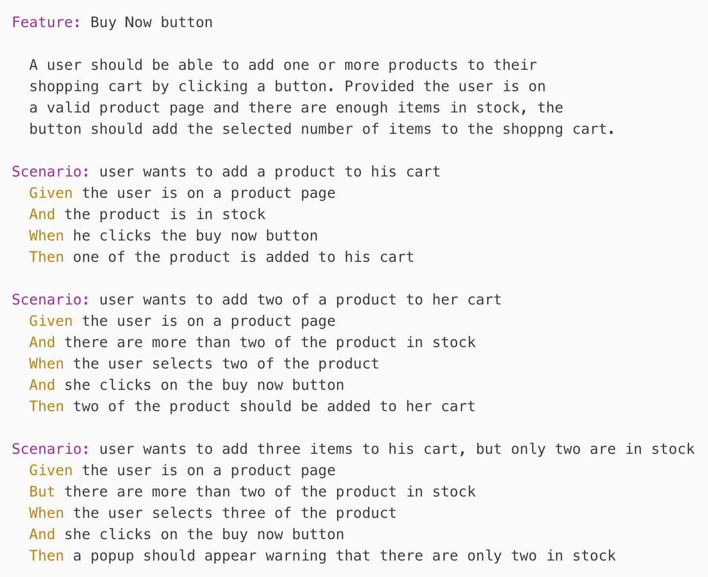

Gherkin is a language designed to allow product teams to define requirements for new features. In Gherkin, every feature is defined in a `.feature` file and follows a very precise syntax. Each line in the file starts with one of the Gherkin keywords and defines one aspect of the feature.

Imagine you have an eCommerce website. You want to create a buy now button that should add the specified number of products to the shopping cart. A simple .feature definition for this might look like:

Each keyword is critical to the process of writing a great Gherkin test.

#### Feature
Gherkin documents start with this keyword, followed by text that provides a description. More simply put, the feature is a description of what the software is supposed to do. This keyword is also used to group scenarios together.
This isn’t really for testing purposes, but it allows you to add documentation on requirements and business rules.

#### Descriptions
If needed, free-form descriptions can also be written underneath the keywords mentioned above, as long as none of your lines start with a keyword.

#### Rule
The rule keyword is used to represent *one business rule that needs to be included*. This provides context for a feature. These “rules” should have *more than one scenario* to show the rule and may have a background section.

### Gherkin Steps

#### Given
Given steps *set the scene for the scenario*. This gives the system context before a user starts interacting with it. You can have *more than one Given step*. 

#### When
When steps are *action steps*. They describe an event. 

#### Then
Then steps are *outcome steps*. This should be something that you can actually see as a result, like a message or report.

#### And, But
When you have several of one of the step types listed above you can use and or but.

#### Background
The background allows you to add even more context to the scenarios in a feature. This is where you can have more than one given step, as needed.
Note: There can only be *one background step for each feature*. If you need more background steps, you’ll have to create different feature files. 

#### Scenario Outline
The scenario outline contains an *examples section*. These steps are read like a template. The scenario outline runes once for each row of the example section except for the header row.

#### References
[Funcionize.com](https://www.functionize.com/blog/what-is-gherkin-how-do-you-write-gherkin-tests)

